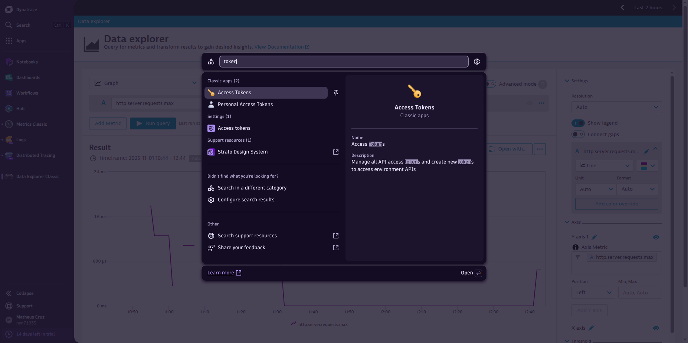
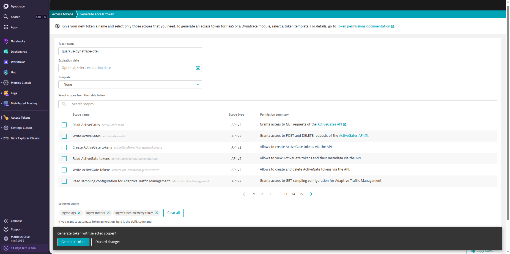
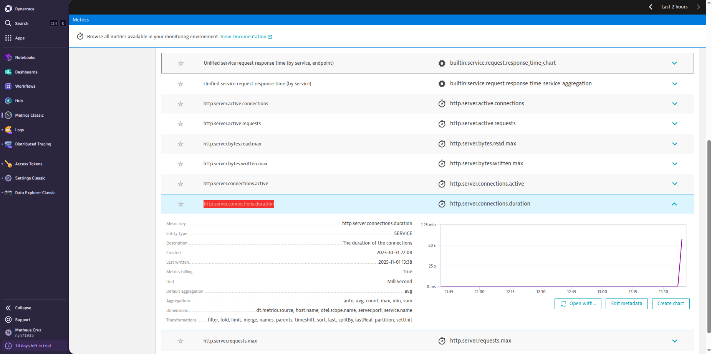
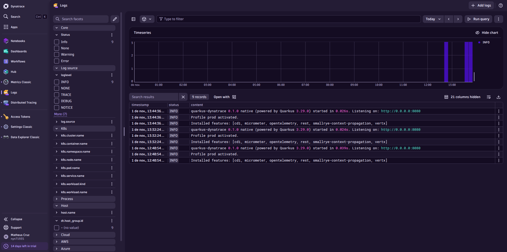

# quarkus-dynatrace

Project created to demonstrate the use of `quarkus-micrometer-opentelemetry` extension sending metric to OTEL collector + Dynatrace.

## Creating a Dynatrace account (Free Trial 15 days)

Access https://www.dynatrace.com/signup and create a free trial account.

After creating the account and access the Dynatrace dashboard, search by Tokens in the left menu:



Create a new token with the following scopes:

- Ingest metrics
- Ingest logs
- Ingest Opentelemetry traces



> [!NOTE]
> Save the generated token, you will need it later.

## Setting up ConfigMap with Dynatrace Token and Dynatrace Tenant

You can get your Dynatrace Tenant URL by accessing the Dynatrace dashboard, and copying the URL until `dynatrace.com`.

> [!IMPORTANT]
> For example: `https://abc12345.live.dynatrace.com`, in this case your tenant is `abc12345`.

Now, replace the placeholders `<dynatrace tenant>` and `<dynatrace token>` in the `k8s/otel-configmap.yaml` file with your actual Dynatrace tenant and token values.

## Building quarkus-dynatrace app

> [!IMPORTANT]
> If you do not want to build the native image locally you can skip this section and go directly
> to [Running quarkus-dynatrace app with KinD](#running-quarkus-dynatrace-app-with-kind) section, where you can find instructions
> to run the application using a pre-built Docker image.

First of all, we need to build our application in a native mode, to do it, you need to run:

```shell
mvn clean package -Dnative
```

After the build successfully finished, you will find the native executable in the `target` folder.

## Creating Docker image

To create a Docker image for the `quarkus-dynatrace` application, you can use the provided `Dockerfile`. Run the following command in the root directory of the project:

```shell
docker build -f src/main/docker/Dockerfile.native -t matheuscruzdev/quarkus-dynatr
ce:0.1.0 .
```

NOTE: Replace `matheuscruzdev` with your Docker Hub username or any preferred name for the image.

## Publishing Docker image

To publish the Docker image to a Docker registry, you can use the following command:

```shell
docker push <username>/quarkus-dynatrace:0.1.0
```

NOTE: Make sure you are logged in to your Docker registry using `docker login` before pushing the image.

## Running quarkus-dynatrace app with KinD

To run the `quarkus-dynatrace` application with KinD (Kubernetes in Docker), you can follow these steps:

1. Create a KinD cluster if you don't have one already:

```shell
kind create cluster --name quarkus-dynatrace-cluster
```

NOTE: You need to have KinD installed on your machine. You can find the installation instructions [here](https://kind.sigs.k8s.io/docs/user/quick-start/).

2. Apply the Kubernetes deployment and service configuration:

```shell
kubectl apply -f k8s/
```

## Testing the setup

### Check if the pods are running

```shell
☁  quarkus-dynatrace  kubectl get pods                                       
NAME                                        READY   STATUS    RESTARTS   AGE
dynatrace-otel-collector-69486c4d57-fdrpr   1/1     Running   0          33s
quarkus-dynatrace-app-57866fd6d4-4wqvp      1/1     Running   0          33s
```

### Accessing the quarkus-dynatrace application

To access the `quarkus-dynatrace` application, you can use port forwarding. Run the following command:

```shell
kubectl port-forward svc/quarkus-dynatrace-app 8080:8080
```

Now, you can access the application by opening your web browser and navigating to `http://localhost:8080/hello`.

Refresh the page a few times to generate some telemetries.

### Verifying telemetries in Dynatrace

After generating some traffic to the `quarkus-dynatrace` application, you can verify if the telemetries are being sent to Dynatrace.

### Looking for Traces

In the Dynatrace dashboard, search for `Distributed Tracing` and you should see traces related to the `quarkus-dynatrace` application.


### Looking for Metrics

In the Dynatrace dashboard, search for `Metrics Classic` and you should see metrics related to the `quarkus-dynatrace` application.

Find by `http.server.connections.duration` metric to see the HTTP server request duration.


### Looking for Logs

First of all, you need to configure the log ingestion in Dynatrace.

Go to `Logs` in the left menu and click on `+ Add logs`.

1. Select `Log ingestion API`.
2. In the `Configure Log ingestion API` select `Use existing token` and select the token you created previously.
3. In the `Verify ingestion setup` step, select the token you created previously.
4. You can preview all logs ingested and click on `Done`.



# For more information

See the official Quarkus documentation about [Observability](https://pt.quarkus.io/guides/observability).
See the official Dynatrace documentation about [Dynatrace Opentelemetry Collector](https://docs.dynatrace.com/docs/ingest-from/opentelemetry/collector).